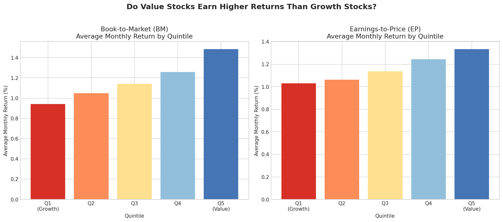
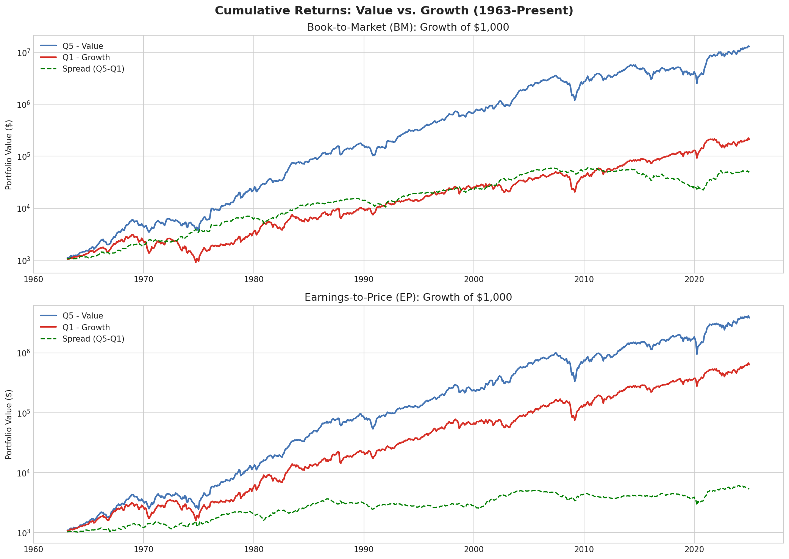
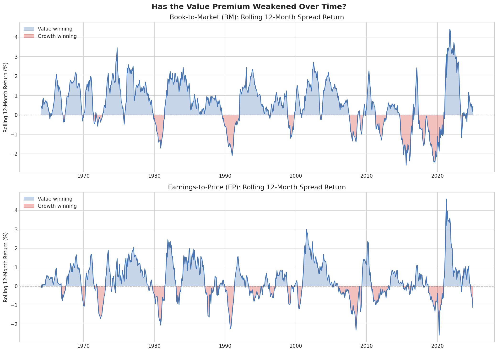

# Value vs. Growth Through Time
### FIN 4975 — Data Analysis in Finance
**Student:** Samantha Impellizeri  
**Professor:** Adam Aiken  
**Date:** May 2026  

---

## Research Question
How do different definitions of value: Book-to-Market (BM) and Earnings-to-Price 
(EP), compare in their ability to predict stock returns, and has the relative 
performance of these measures changed over time?

---

## Motivation
Value investing — buying stocks that are cheap relative to their fundamentals — 
is one of the most studied strategies in finance. Fama and French (1993) 
documented that high Book-to-Market stocks consistently outperform low 
Book-to-Market stocks. However, in recent decades this "value premium" has 
weakened significantly, particularly after the 2008 financial crisis.

This project investigates two questions:
1. Does the value premium still exist?
2. Does it matter how you define "value"?

We compare two measures — BM and EP — across five notebooks covering 
descriptive analysis, regression testing, factor models, and macro analysis.

---

## Data Sources
- **Open Asset Pricing** — Quintile portfolio returns for BM and EP signals  
  (Chen & Zimmermann, 2022)
- **Fama-French Data Library** — Three-factor model returns (Mkt-RF, SMB, HML)  
  (Fama & French, 1993)
- **FRED** — 10-year Treasury yield (GS10) and VIX (VIXCLS)

---

## Repository Structure
| Notebook | Description |
|---|---|
| `01_data.ipynb` | Download and clean BM, EP, and Fama-French data |
| `02_charts.ipynb` | Bar charts, cumulative returns, rolling spreads |
| `03_regression.ipynb` | Time trend and post-2007 OLS regressions |
| `04_factor_model.ipynb` | Fama-French three-factor regressions |
| `05_macro.ipynb` | FRED macro data and interest rate regressions |

---

## Key Findings

### 1. The Value Premium Exists But Has Weakened

The bar chart above shows average monthly returns for each quintile group. 
For both BM and EP, value stocks (Q5, shown in blue) earn higher average 
returns than growth stocks (Q1, shown in red) over the full sample period. 
This confirms the basic premise of value investing, cheap stocks have 
historically outperformed expensive ones.

The cumulative return chart shows how $1,000 invested in value vs growth 
would have grown since 1963. Value stocks built up a significant lead in 
earlier decades, but the gap has narrowed considerably in recent years as 
growth stocks — particularly large tech companies — dominated the market.

### 2. The Decline is Statistically Significant for BM — But Not EP

The rolling 12-month chart above makes the story visual — blue areas show 
periods where value beat growth, pink areas show growth winning. Notice how 
pink periods become more frequent and deeper after 2007, particularly between 
2017 and 2020 when large tech stocks dominated. This is not just visual noise 
— our regression confirms it is statistically real.

Our time trend regression shows that the BM value premium has declined 
significantly over time (t = -2.342, p = 0.019). The post-2007 dummy 
confirms this collapse was concentrated after the financial crisis 
(coefficient = -0.81%, t = -3.077, p = 0.002).

EP tells a different story — neither the time trend nor the post-2007 
dummy is statistically significant, suggesting EP has been a more 
stable value measure over time.

### 3. BM Generates Alpha Beyond the Fama-French Factors
Our factor model regression shows BM generates statistically significant 
alpha of 0.40% per month (t = 3.684, p = 0.000) even after controlling 
for market, size, and value risk. EP generates no significant alpha 
(t = 0.507, p = 0.613).

### 3. BM Generates Alpha Beyond the Fama-French Factors

We regressed both spreads on the Fama-French three factors: the market 
return (Mkt-RF), size factor (SMB), and value factor (HML). Both BM and EP 
load heavily on HML (0.69 and 0.68), which makes sense since HML is 
essentially the academic version of the value premium.

The key difference is in alpha, the return that cannot be explained by 
known risk factors. BM generates a statistically significant alpha of 
0.40% per month (t = 3.684, p = 0.000), meaning it earns extra returns 
beyond what the model predicts. EP generates no significant alpha 
(t = 0.507, p = 0.613), meaning its returns are fully explained by 
the three factors.

### 4. Rising Interest Rates Benefit the BM Value Premium

We downloaded 10-year Treasury yield and VIX data from FRED and regressed 
the value spreads on these macro variables. The idea is simple: when interest 
rates fall, investors discount future cash flows at a lower rate, which 
makes growth stocks, whose value comes from distant future earnings,
worth relatively more today.

Our results support this: when the 10-year Treasury yield rises by 1%, 
the BM value spread increases by 0.02 per month (t = 2.640). This helps 
explain why value struggled so much after 2008 — the Fed kept rates near 
zero for years, consistently favoring growth over value.

VIX is not significant for either measure, and EP shows no significant 
relationship with macro variables at all (R-squared = 0.0005).
---

## Conclusion

This project set out to answer two questions: does the value premium still 
exist, and does it matter how you define value? The answer to both is yes.

**The value premium is real but has weakened.** Both BM and EP show that 
cheap stocks have historically outperformed expensive ones. But the rolling 
return charts tell a clear story: the periods where growth beats value have 
become longer and deeper since 2007, particularly between 2017 and 2020 when 
mega-cap tech companies like Apple, Amazon, and Google dominated the market.

**How you define value matters enormously.** This is the most interesting 
finding of the project. BM and EP tell very different stories:

- **BM (Book-to-Market)** has declined significantly over time and is 
  sensitive to interest rates. This makes intuitive sense, book value 
  is a less meaningful measure in today's economy, where the most valuable 
  companies (like Google or Microsoft) derive their worth from intangible 
  assets like software and brand recognition that don't appear on a 
  balance sheet. Despite this, BM still generates statistically significant 
  alpha beyond the Fama-French factors.

- **EP (Earnings-to-Price)** has been more stable over time and is not 
  sensitive to macro conditions. However, it generates no independent alpha 
  — its returns are fully explained by known risk factors.

**What this means for a hedge fund.** If we were recommending a value 
strategy today, EP may be the more reliable signal given its stability 
across different market regimes. BM's sensitivity to interest rates makes 
it more useful as a macro-timing tool, for example, overweighting value 
when rates are rising and underweighting when rates are falling.

The broader takeaway is that factor investing requires constant evaluation. 
Signals that worked for decades can weaken as markets evolve, and the 
definition of a factor matters just as much as the factor itself.

---

## References
- Chen, A., & Zimmermann, T. (2022). Open asset pricing. *Journal of 
  Financial Economics*, 145(2), 795–817.
- Fama, E. F., & French, K. R. (1993). Common risk factors in the returns 
  on stocks and bonds. *Journal of Financial Economics*, 33(1), 3–56.
- Lakonishok, J., Shleifer, A., & Vishny, R. W. (1994). Contrarian 
  investment, extrapolation, and risk. *Journal of Finance*, 49(5), 1541–1578.